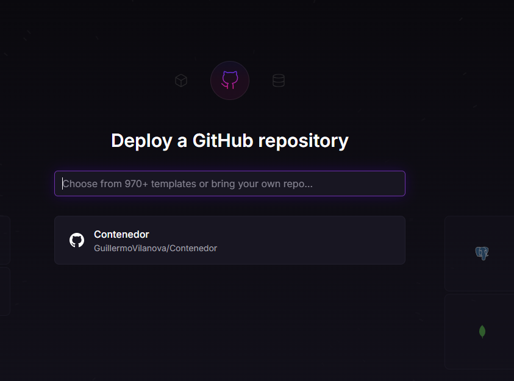
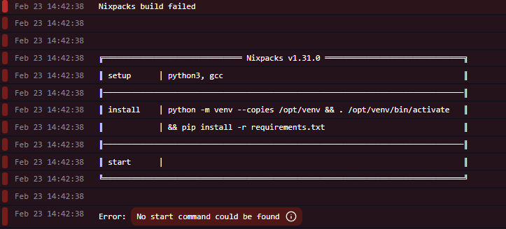
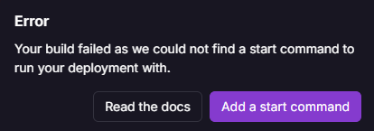

## **Guía para Crear y Desplegar una App en un Contenedor Docker**

### **1. Requisitos Previos**
- Tener instalado:
  - [Docker](https://www.docker.com/get-started) (sigue las instrucciones de la página).
  - Un editor de código como [VS Code](https://code.visualstudio.com/) o Sublime Text.
- Cuentas gratuitas en:
  - [GitHub](https://github.com/)
  - [Docker Hub](https://hub.docker.com/)
  - [Railway](https://railway.app)

---

### **2. Crear la Aplicación**
#### a) **Archivo `app.py`** (la app web)
1. Abre tu editor de código y crea un archivo llamado `app.py`.
2. Copia este código:

    ```python
    from flask import Flask
    app = Flask(__name__)

    @app.route('/')
    def hello():
        return "¡Hola desde Docker! 🐳"

    if __name__ == '__main__':
        app.run(host='0.0.0.0', port=5000)
    ```

#### b) **Archivo `requirements.txt`** (dependencias)
1. Crea otro archivo llamado `requirements.txt`.
2. Copia esto:
   ```
   Flask==3.0.2
   gunicorn==21.2.0
   ```

---

### **3. Crear el Dockerfile** (receta para el contenedor)
1. Crea un archivo llamado `Dockerfile` (sin extensión).
2. Copia esto:
   ```Dockerfile
   FROM python:3.11-slim
   WORKDIR /app
   COPY requirements.txt .
   RUN pip install -r requirements.txt
   COPY app.py .
   EXPOSE 5000
   CMD ["gunicorn", "--bind", "0.0.0.0:5000", "app:app"]
   ```

---

### **4. Probar Localmente**
#### a) **Construir el Contenedor**
1. Abre una terminal en la carpeta de tu proyecto.
2. Ejecuta:
   ```bash
   docker build -t my-flask-app .
   ```


#### b) **Ejecutar el Contenedor**
```bash
docker run -p 5000:5000 my-flask-app
```


3. Abre tu navegador en: http://localhost:5000  
   ¡Deberías ver el mensaje de bienvenida!


#### c) **Detener el Contenedor**
Presiona `Ctrl + C` en la terminal o usa:
```bash
docker stop [ID_del_contenedor]
```

---

### **5. Subir a Docker Hub (con GitHub Actions)**
#### a) **Preparar GitHub**
1. Crea un repositorio nuevo en GitHub.

2. Sube tus archivos (`app.py`, `requirements.txt`, `Dockerfile`).

#### b) **Crear el Workflow de GitHub**
1. Crea una carpeta `.github/workflows` en tu proyecto.
2. Dentro, crea un archivo `docker-publish.yml` con este contenido:

```yaml
   name: Docker Build and Push

on:
  push:
    branches: ["main"]

jobs:
  build-and-push:
    runs-on: ubuntu-latest
    steps:
      - name: Checkout code
        uses: actions/checkout@v4

      - name: Login to Docker Hub
        uses: docker/login-action@v3
        with:
          username: ${{ secrets.DOCKER_USERNAME }}
          password: ${{ secrets.DOCKER_PASSWORD }}

      - name: Build and Push Docker image
        uses: docker/build-push-action@v5
        with:
          context: .
          push: true
          tags: ${{ secrets.DOCKER_USERNAME }}/my-flask-app:latest

      - name: List files for debugging
        run: ls -R

   ```

#### c) **Configurar Secrets en GitHub**
1. En tu repositorio de GitHub, ve a **Settings > Secrets > Actions**.
2. Crea dos secrets:
   - `DOCKER_USERNAME`: Tu usuario de Docker Hub.
   - `DOCKER_PASSWORD`: [Crea un token aquí](https://hub.docker.com/settings/security). si no funciona pon tu contraseña de docker!

#### d) **Subir los Archivos a GitHub**
1. Asegúrate de que tu proyecto tenga esta estructura:
   ```
   tu-proyecto/
   ├── app.py
   ├── requirements.txt
   ├── Dockerfile
   └── .github/
       └── workflows/
           └── docker-publish.yml
   ```
2. Sube los archivos a GitHub:
   - Si usas GitHub Desktop, arrastra la carpeta del proyecto.
   - Si usas la terminal, ejecuta:
     ```bash
     git add .
     git commit -m "Primera subida"
     git push origin main
     ```

---

### **6. Verificar el Workflow**
1. Ve a tu repositorio en GitHub.
2. Haz clic en la pestaña **Actions**.
3. Deberías ver un workflow llamado "Docker Build and Push" en ejecución.
4. Si todo está bien, verás una marca verde (✅) cuando termine.


---

### **Estructura Final de tu Proyecto**
```
tu-proyecto/
├── app.py
├── requirements.txt
├── Dockerfile
└── .github/
    └── workflows/
        └── docker-publish.yml
```

---

### **Notas Importantes**
- Si tienes errores:
  - **Puerto 5000 en uso**: Cambia el puerto en `docker run -p 8080:5000 ...`.
  - **Problemas con Docker Hub**: Verifica que el token tenga permisos de escritura.
- Railway te da un dominio gratis tipo `https://tu-app.up.railway.app`.

---


<div style="page-break-after: always;"></div>


### **Desplegar en Railway**

---

### **1. Crear una Cuenta en Railway**
1. Ve a [Railway](https://railway.app/) y crea una cuenta (puedes usar GitHub, Google o un correo electrónico).
2. Una vez registrado, serás redirigido al panel de control de Railway.

---

### **2. Crear un Nuevo Proyecto**
1. En el panel de Railway, haz clic en **New Project**.
2. Selecciona la opción **Deploy from Docker Hub**.


---

### **3. Conectar Docker Hub**
1. Si has enlazado tu cuenta de GitHub te saldrá en la lista, sino Railway te pedirá que ingreses el nombre de la imagen que subiste a Docker Hub.
2. Para ello escribe el nombre de la imagen en este formato:
   ```
   tudockerhubusuario/my-flask-app:latest
   ```
   - Reemplaza `tudockerhubusuario` con tu nombre de usuario de Docker Hub.
   - Reemplaza `my-flask-app` con el nombre de tu imagen.
   - `latest` es la etiqueta (tag) de la imagen.

3. Haz clic en **Deploy**. Si te da error, es que no logra encontrar el comando de inicio.
En mi caso ```gunicorn --bind 0.0.0.0:5000 app:app```




---

### **4. Configurar el Puerto**
1. Railway detectará automáticamente que tu aplicación usa el puerto `5000` (definido en el Dockerfile con `EXPOSE 5000`).
2. Si necesitas cambiar el puerto, ve a la pestaña **Settings** de tu proyecto en Railway y ajusta la variable de entorno `PORT`.

---

### **5. Acceder a la Aplicación**
1. Una vez que Railway termine de desplegar tu aplicación, te proporcionará un enlace para acceder a ella.
2. El enlace tendrá un formato como este: `https://tu-app.up.railway.app`.
3. Haz clic en el enlace para ver tu aplicación en vivo.

---

### **6. (Opcional) Configurar un Dominio Personalizado**
Si quieres usar un dominio personalizado en lugar del que proporciona Railway:
1. Ve a la pestaña **Settings** de tu proyecto.
2. En la sección **Domains**, agrega tu dominio personalizado.
3. Sigue las instrucciones para configurar los registros DNS en tu proveedor de dominios.

---

### **7. Verificar el Logs**
Si algo no funciona correctamente, puedes revisar los logs:
1. En el panel de Railway, ve a la pestaña **Logs**.
2. Aquí verás los mensajes de la aplicación y cualquier error que pueda haber ocurrido durante el despliegue.

---

### **8. Actualizar la Aplicación**
Si haces cambios en tu aplicación y subes una nueva imagen a Docker Hub:
1. Railway detectará automáticamente la nueva versión y la desplegará.
2. Si no se actualiza automáticamente, puedes forzar un nuevo despliegue desde el panel de Railway.

---

### **Resumen de Pasos**
1. Crea una cuenta en Railway.
2. Crea un nuevo proyecto y selecciona **Deploy from Docker Hub**.
3. Ingresa el nombre de tu imagen en Docker Hub.
4. Configura el puerto si es necesario.
5. Accede a tu aplicación usando el enlace proporcionado por Railway.

---

### **Notas Importantes**
- Railway ofrece un **plan gratuito** con límites generosos, ideal para proyectos pequeños.
- Si tu aplicación necesita variables de entorno (como claves de API), puedes configurarlas en la pestaña **Variables** de Railway.
- Railway maneja automáticamente el escalado y los certificados HTTPS.

---

¿Necesitas más ayuda con esto? 😊 ¡Avísame si encuentras algún otro problema!